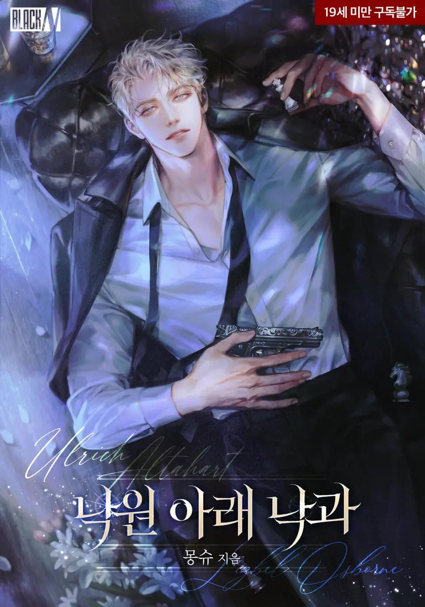

<!--
This is the Platinum Typing Effect Header
-->

<!-- Badges Section: Visually represents key attributes -->

<!-- Genre Badge: UPDATED TO DARK ROMANCE -->

<!-- Status Badge (assuming it's complete/active) -->

<!-- Format Badge -->

<!-- All sections below the image are now left-aligned -->

Dark romance with an absolutely unhinged black flag ML.

<!-- Hidden Header Row and Separator to force the visual table look -->

 

 

 

Author

Mongsu (몽슈)

The original creator.

Translator

RainOfSnow Team

Provided the core text translation.

I just removed all the censorship to get audiobook vibes

&nbsp;

<i style="color: #E5E4E2;"> <b> "This was truly an entire world made for Ulrich" </b> </i>

— TL Note from RainOfSnow

